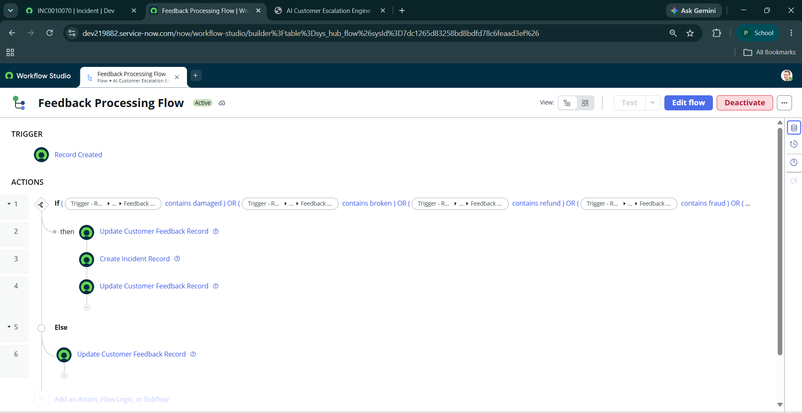
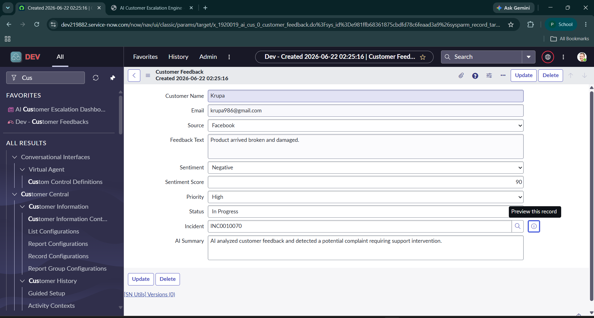
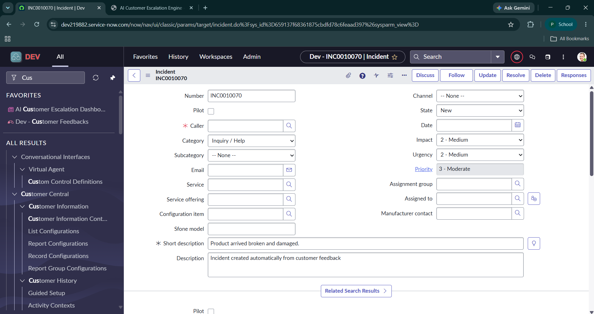
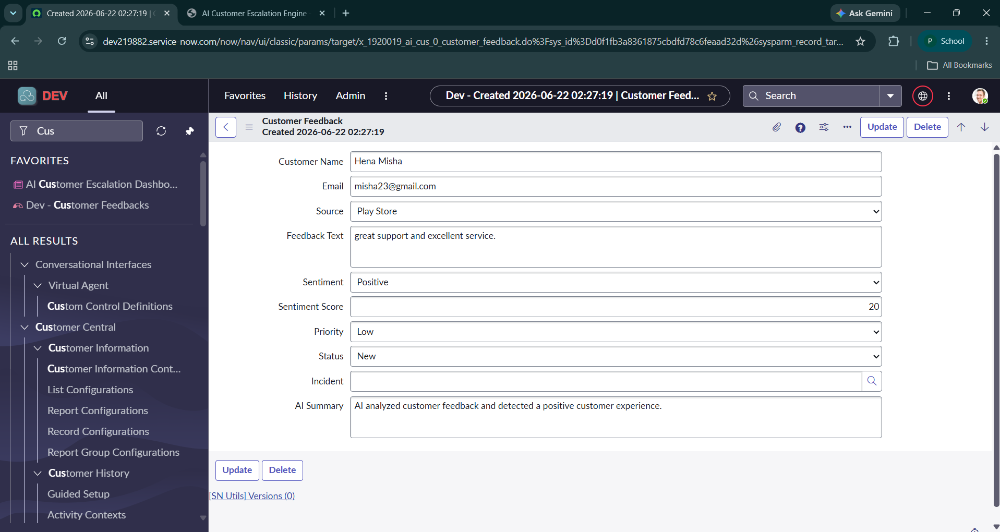
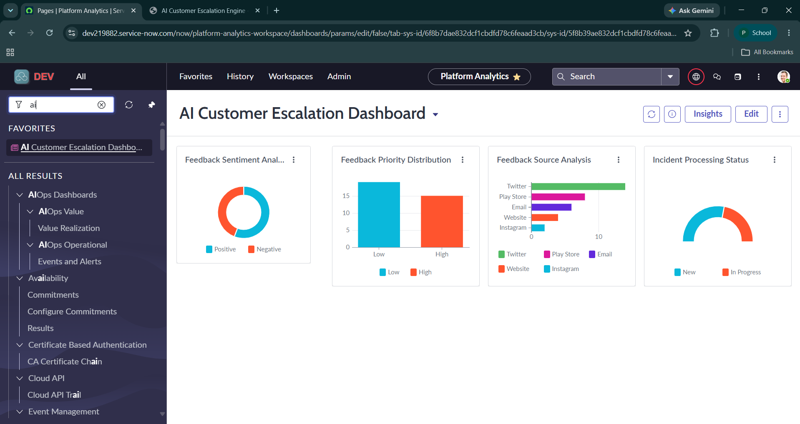

# 🚀 AI Customer Escalation Engine

## 📌 Overview

The AI Customer Escalation Engine is a ServiceNow-based automation solution designed to streamline customer support operations by automatically analyzing customer feedback, identifying critical complaints, and generating incidents for immediate action.

The application processes feedback from multiple sources such as Twitter, Email, and Play Store reviews, classifies customer sentiment, assigns priorities, and escalates high-risk issues through ServiceNow Incident Management.

---

## 🎯 Problem Statement

Organizations receive thousands of customer reviews, complaints, and support requests across various channels. Manually identifying critical issues can be time-consuming, leading to delayed responses and reduced customer satisfaction.

This project automates the entire process by:

* Detecting negative customer feedback
* Prioritizing critical complaints
* Automatically creating incidents
* Providing real-time visibility through dashboards

---

## 🛠️ Solution Architecture

Customer Feedback → Flow Designer → Sentiment Analysis Logic → Priority Assignment → Incident Creation → Dashboard & Reporting

---

## ✨ Key Features

### Customer Feedback Management

* Custom ServiceNow application
* Custom Customer Feedback table
* Multi-source feedback collection

### Automated Sentiment Classification

* Detects positive and negative customer feedback
* Keyword-based sentiment evaluation
* Generates sentiment scores automatically

### Intelligent Escalation

* Automatically assigns priority levels
* Creates incidents for critical complaints
* Links incidents back to customer feedback records

### Workflow Automation

* Built using ServiceNow Flow Designer
* Automated record updates
* Zero manual intervention required

### Reporting & Analytics

* Feedback Sentiment Dashboard
* Priority Distribution Reports
* High-Priority Complaint Monitoring

---

## 🔄 Workflow

### Negative Feedback Flow

1. Customer submits feedback
2. System detects critical keywords
3. Sentiment set to Negative
4. Priority set to High
5. Status updated to In Progress
6. Incident automatically created
7. AI Summary generated

### Positive Feedback Flow

1. Customer submits feedback
2. System detects positive feedback
3. Sentiment set to Positive
4. Priority set to Low
5. Status remains New
6. No incident created

---

## 📷 Project Screenshots

### Flow Designer Automation

### Negative Feedback Processing

### Auto-Created Incident

### Positive Feedback Processing

### Dashboard & Reports

---

## 🎥 Demo Video

Project demonstration video available in:

---

## 🏗️ Technologies Used

* ServiceNow Studio
* Flow Designer
* Incident Management
* Custom Tables
* Business Rules
* Reporting & Dashboards
* GitLab
* GitHub

---

## 📊 Sample Business Impact

* Faster complaint resolution
* Reduced manual effort
* Automated incident escalation
* Improved customer satisfaction
* Better visibility into customer sentiment trends

---

## 🚀 Future Enhancements

* Integration with Social Media APIs
* REST API-based feedback ingestion
* AI/ML Sentiment Analysis Integration
* Predictive Intelligence Implementation
* Agent Workspace Dashboard
* Real-Time Notifications

---

## 👨‍💻 Developer

**Pankti Parmar**

Computer Engineering Student | ServiceNow Developer | AI & Automation Enthusiast

GitHub: https://github.com/Pankti2312

---

⭐ If you found this project interesting, feel free to star the repository and connect with me.
